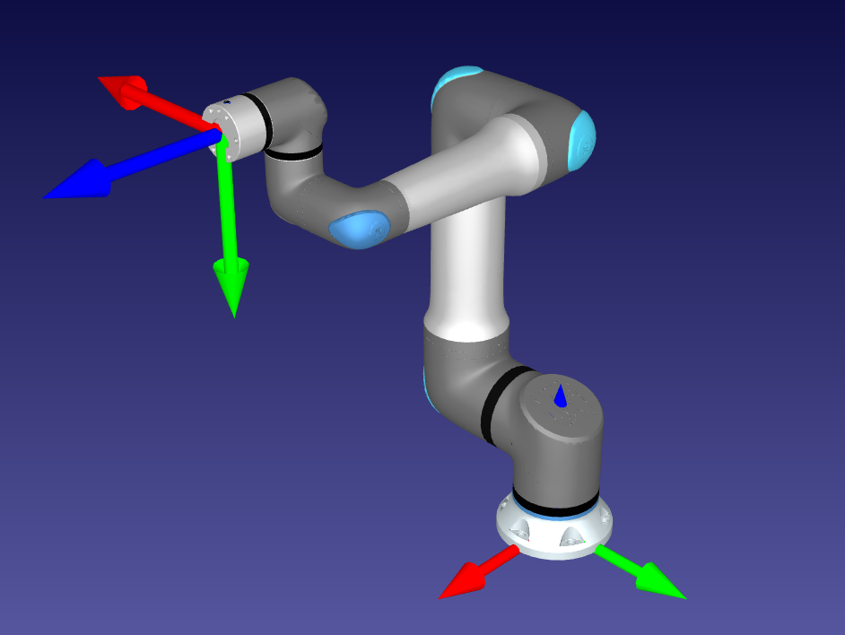

# Espacio de trabajo y elementos que lo conforman

En esta página, se muestran y detallan los elementos utilizados para la simulación en **RoboDK**

Contenido:
- [UR30](#brazo-de-universal-robots-ur30)
- [2. Cinemática Directa](02-estructura-del-repo.md)
- [3. Cinemática Inversa y Planificación de Trayectorias](03-markdown.md)
- [4. Control Cinemático](04-estilos.md)

---

## Brazo de Universal Robots UR30

El robot UR30 es un brazo robótico de 6 ejes, tiene una carga útil de 30.0 kg y un alcance de 1300 mm. Además, puede levantar cargas pesadas manteniendo un tamaño compacto en un entorno colaborativo.

Sus aplicaciones más comunes en la industria son: 

   - Ideal para la alimentación de máquinas
   - Manipulación de materiales 
   - Paletizado de productos pesados 
   - Atornillado de alto par.

> Modelo del brazo colaborativo [UR30](https://robodk.com/3D/es/robot/UR30) extraído desde **RoboDK**

---

## Siguiente sección
[Estructura del repositorio ](02-estructura-del-repo.md)