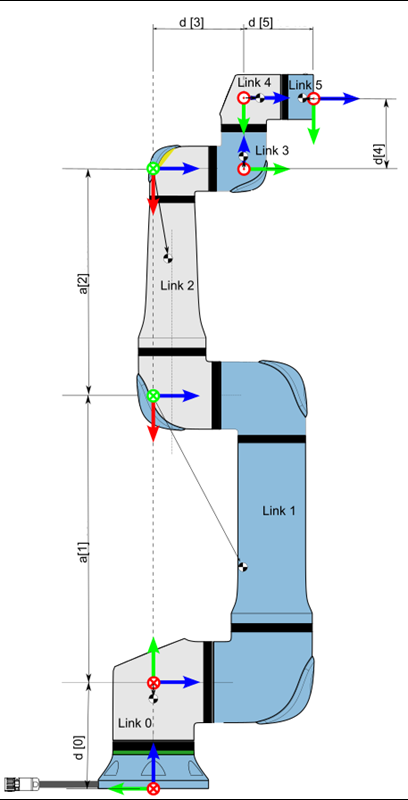
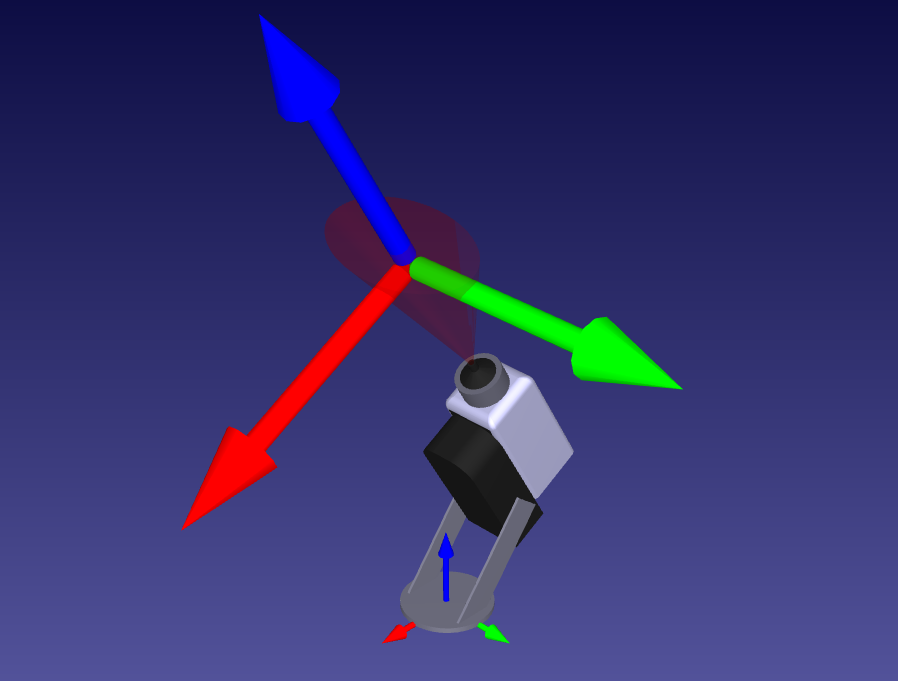
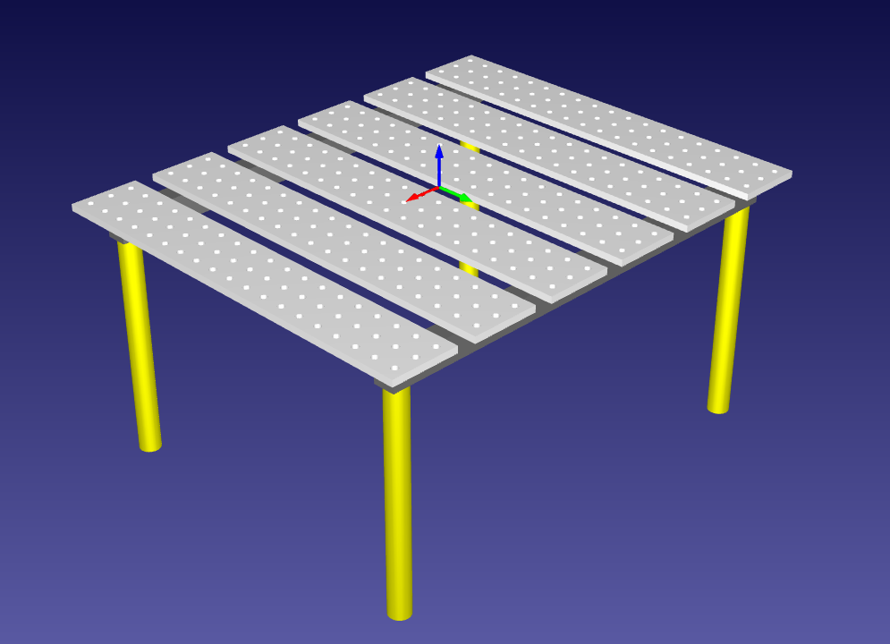
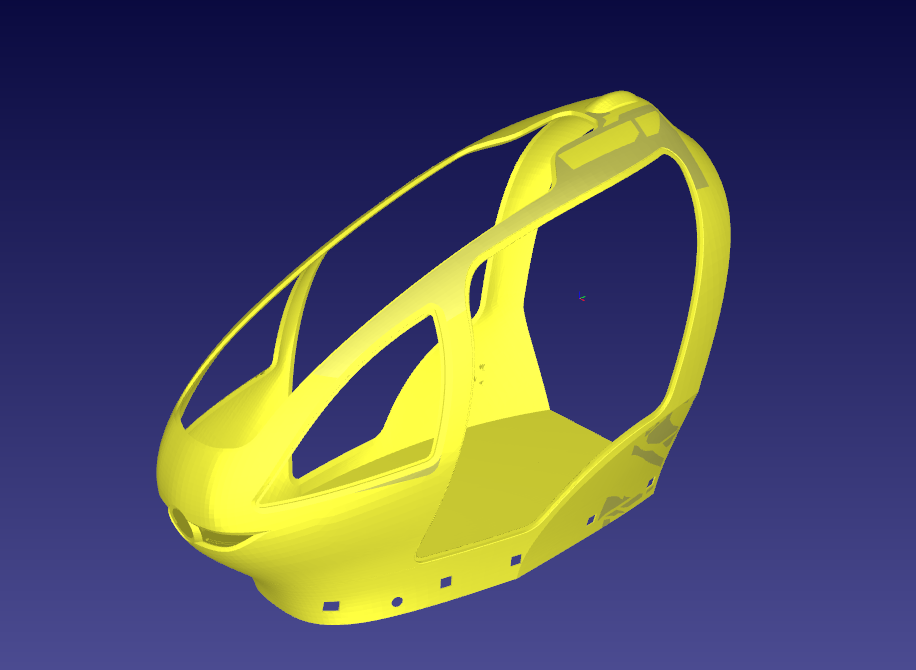

# Espacio de trabajo y elementos que lo conforman

En esta página, se muestran y detallan los elementos utilizados para la simulación en **RoboDK**

Contenido:
- [UR30](#brazo-de-universal-robots-ur30)
- [2. Cinemática Directa](02-estructura-del-repo.md)
- [3. Cinemática Inversa y Planificación de Trayectorias](03-markdown.md)
- [4. Control Cinemático](04-estilos.md)

---

## Brazo de Universal Robots UR30

El robot UR30 es un brazo robótico de 6 ejes, tiene una carga útil de 30.0 kg y un alcance de 1300 mm. Además, puede levantar cargas pesadas manteniendo un tamaño compacto en un entorno colaborativo.

Sus aplicaciones más comunes en la industria son: 

   - Ideal para la alimentación de máquinas
   - Manipulación de materiales 
   - Paletizado de productos pesados 
   - Atornillado de alto par.

> Modelo del brazo colaborativo [UR30](https://robodk.com/3D/es/robot/UR30) extraído desde **RoboDK**

### Características principales del UR30

   - **Seis grados de libertad** representado en sus seis articulaciones que lo componen
   - **Repetitividad de ± 0.1 mm** que garantiza una precisión constantes en tareas que se repiten con frecuencia
   - **Peso de 65 kg** lo que lo hace relativamente ligero y fácil de reubicar
   - **Consumo Eléctrico de aproximadamente 300 W** en uso típico (máximo de 750 W).
   - **Torque elevado** para manejar un par de torsión alto
   - **Diversas funciones de seguridad configurables**, como detección de fuerza y colisión, permitiéndole trabajar junto a operarios sin necesidad de vallas de seguridad
   - **Grado de Protección con certificación IP65**, lo que lo protege contra el polvo y chorros de agua
   - **Huella Compacta con una base de solo Ø 245 mm** para instalarse en celdas de trabajo donde el espacio es muy limitado.

### Parámetros de Denavit-Hatenberg 

Los parámetros de Denavit-Hartenberg (DH) son un método sistemático para representar las cadenas cinemáticas de los brazos robóticos. Simplifican el modelado matemático de robots al proporcionar una notción estándar para describir las posiciones y orientaciones relativas de los enlaces adyacentes. Los cuatro parámetros DH —longitud del enlace, torsión del enlace, desplazamiento del enlace y ángulo de la articulación— permiten la descripción precisa de cada articulación en términos de un sistema de coordenadas común, lo que facilita la derivación de las ecuaciones cinemáticas necesarias para controlar el movimiento del robot.

A continuación se mostrará un diagrama que ayuda a la forma en la que se obtienen dichos parámetros.

> Diagrama de parámetros de DH para robots [UR](https://www.universal-robots.com/articles/ur/application-installation/dh-parameters-for-calculations-of-kinematics-and-dynamics/). Extraído desde la página oficial de Universal Robots

Los parámetros d, alpha y a se mostrarán en la siguiente tabla:

| Junta     | a [m]     | d [m]        | alpha [rad] |
|----------:|:---------:|:-------------|:------------|
| Junta 1   | 0         | 0.2363       | π/2         |
| Junta 2   | -0.6370   | 0            | 0           |
| Junta 3   | -0.5037   | 0            | 0           |
| Junta 4   | 0         | 0.2010       | π/2         |
| Junta 5   | 0         | 0.1593       | -π/2        |
| Junta 6   | 0         | 0.1543       | 0           |

Con los datos de esta tabla, se podrá obtener la Pose (matriz homogenea) del efector final del robot con respecto a la base. Es decir, su cinemática directa.

---

## Herramienta Generic Paint Sprayer

El **Generic Paint Sprayer** es la herramienta que se acopla al efector final del UR30. No está basado en alguna herramienta real/comercial, por lo que esta es únicamente para uso académico.

> Modelo de [Generic Paint Sprayer](https://robodk.com/3D/es/tool/Generic-Paint-Sprayer) extraído desde **RoboDK**

---

## Mesa de trabajo

A continuación se mostrará la mesa de trabajo empleada para la simulación.

> Modelo de [Mesa de trabajo](https://robodk.com/3D/es/object/Table-1200x1000mm-Welding) extraído desde **RoboDK**

## Chasis del EHang 184

El EHang 184 es el primer vehículo aéreo autónomo (AAV) eléctrico del mundo diseñado para transportar pasajeros, presentado en 2016 como un taxi dron monoplaza. Diseñado para distancias cortas, alcanza entre 100 a 130 km/h y funciona sin piloto.
El pasajero selecciona el destino a través de una aplicación.

Para este proyecto, se buscó en internet un stl con un modelo a escala de un EHang 184. Se optó por pintar el chasis como si se tratara de una linea de producción de este vehículo.

A continuación se mostrará el modelo.

> Modelo del [Chasis de Ehang 184](https://www.elecrow.com/sharepj/future-in-the-sky-ehang-184-3d-printed-air-taxi-1112.html) extraído desde **ELECROW**

---

## Siguiente sección
[Estructura del repositorio ](02-estructura-del-repo.md)