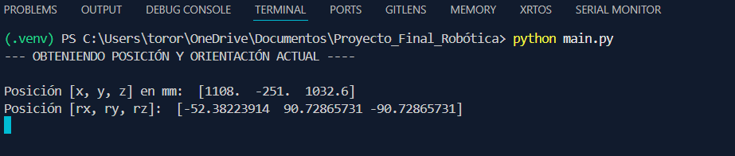
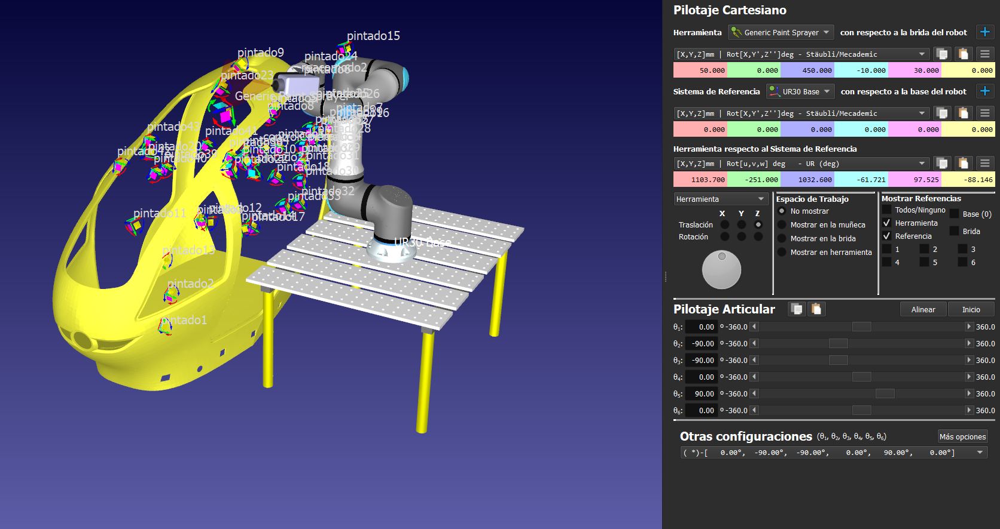

# Cinemática directa del UR30

En esta sección se detallará el método que se empleó para poder obtener la cinemática directa del UR30. Además de la forma en la que se obtuvieron los datos de la Pose del TCP del robot y la comprobación del script realizado en Python para obtener estos datos.


Contenido:
- [Método empleado](#método-empleado)
- [Obtención de la Posición Cartesiana](#obtención-de-la-posición-cartesiana)
- [Obtención de la Orientación en Eje-Ángulo](#obtención-de-la-orientación-en-eje-ángulo)
- [Comprobación](#comprobación)

---

## Método empleado

Como anteriormente se mencionó, el método para calcular la Cinemática directa fue el de **Denavit-Hatenberg**, con ayuda de la tabla de parámetros de DH que proporciona Universal Robots sobre sus brazos. 

Una vez se obtuvieran dichos parámetros, estos deben de ser evaluados en la siguiente matriz de 4x4:

```python
Aj = array([
  [cos(self.θ[i]), -sin(self.θ[i])*cos(self.__α[i]), sin(self.θ[i])*sin(self.__α[i]), self.__a[i]*cos(self.θ[i])],
  [sin(self.θ[i]), cos(self.θ[i])*cos(self.__α[i]), -cos(self.θ[i])*sin(self.__α[i]), self.__a[i]*sin(self.θ[i])],
  [0,              sin(self.__α[i]),                 cos(self.__α[i]),                self.__d[i]],
  [0,              0,                                0,                               1]
])
```
Y posteriormente, iterarlo según el número de articulaciones (o juntas).

Como resultado, obtendremos una **matriz homogenea** de 4x4 que considera la pose del efector final del robot con respecto a su base.

Sin embargo, se debe de considerar la herramienta para obtener la cinemática directa completa del robot.

Afortunadamente, **RoboDK** permite copiar la matriz homogenea de 4x4 de los objetos que posee en su vasta biblioteca, por lo que sólo basta con guardarla:

```python
tool = array([
  [0.866025, 0, 0.5,      0.050],
  [0,        1, 0,        0],
  [-0.5,     0, 0.866025, 0.450],
  [0,        0, 0,        1]
])
```

Y posteriormente, multiplicar la matriz homogenea DH, que se calculó anteriormente, con la de la herramienta

```python
T0_tool = T06 @ tool
```
Y así se obtiene la cinemática directa combinando **Matrices Homogeneas y Denavit-Hatenberg**

---

## Obtención de la posición cartesiana

Para obtener las posiciones cartesianas, sólo basta con tomar la matriz homogenea de cinemática directa y extraer las primeras 3 componentes de la cuarta columna. Estas representan la posición en X, Y y Z del efector final.

```python
Posicion = T0_tool.col(3)

X = Posicion[0]
y = Posicion[1]
z = Posicion[2]
```

> Nota: RoboDK trabaja con mm, mientras que el programa trabaja con m, por lo que se tienen que multiplicar cada uno de las componentes x1000 si es que se desea representar en mm.

---

## Obtención de la orientación en eje-ángulo

Para obtener la orientación del efector final, es necesario de procesar la **matriz de rotación** que contiene la **matriz Homogenea** del efector final. 

```python
mat_rot = T0_tool[:3, :3]
```
Existen diferentes notaciones para representar la orientación de un punto dentro del espacio. Sin embargo, RoboDK y Universal Robots suelen trabajar con **Eje-Ángulo**, por lo que los datos obtenidos a continuación se procesarán en dicha notación.

Entonces, se debe ahora de calcular el vector **Eje-Ángulo**. Primero se calcula el ángulo de rotación de la siguiente forma:

```python
θ = acos((matrix.trace(mat_rot) - 1) / 2 )
```

Y el eje unitario como

```python
 A = 1/(2*sin(θ))

 B = array([
  [mat_rot[2, 1] - mat_rot[1, 2]],
  [mat_rot[0, 2] - mat_rot[2, 0]],
  [mat_rot[1, 0] - mat_rot[0, 1]]
])

 u = A * B
```

Por último, se calcula el vector de orientación multiplicando el ángulo de rotación con el eje unitario

```python
r_ur = u*θ
r_ur_deg = rad2deg(r_ur)
```

> Nota: Como en el caso anterior, RoboDK y Universal Robots trabajan con grados; mientras que el programa con radianes. Por lo que es necesario pasar cada componente del vector a grados

---

## Comprobación

A continuación se mostrará la obtención de la cinemática directa con el script de Python y una comparación de los datos obtenidos con el programa contra los que RoboDK dicta:



> Resultados obtenidos con el script de Python



> Resultados de RoboDK

La configuración que se tomó en cuenta para este ejemplo es la inicial que ofrece Robodk:

  - Base: 0°
  - Hombro: -90°
  - Codo: -90°
  - Muñeca 1: 0°
  - Muñeca 2: 90°
  - Muñeca 3: 0°

Los resultados que se muestran a continuación tienen un margen de error muy pequeño, siendo milímetros. En el caso de las orientaciones es debido a las conversión que se tiene que realizar después para representarlo en grados. 

Para el resto de la simulación, la cinemática directa es uno de los elementos que se está actualizando y ejecutando constantemente para realizar la trayectoria que debe de cumplir el robot.

> Para mayor información visitar el repositorio de [Github asociado al proyecto](https://github.com/diegoBravo-dev/Proyecto-Final-de-Rob-tica-con-un-UR30-en-Robodk)

---

## Siguiente tema

[Cinemática Inversa y Planificación de Trayectoria](03-cinematica-inversa-planeacion-trayectoria.md)
